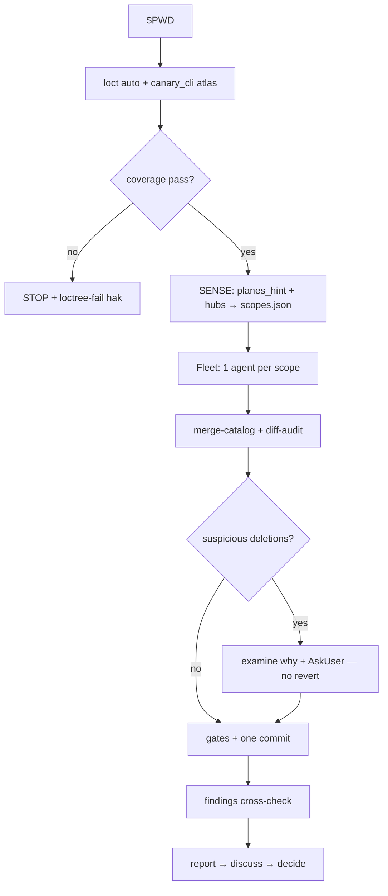

# `vc-canary` Flow

## Phase contract

| Phase    | Question                            | Output                      |
| -------- | ----------------------------------- | --------------------------- |
| Atlas    | Is inventory complete with receipt? | `.loctree/atlas/*`          |
| Sense    | Which planes?                       | `scopes.json` + briefs      |
| Fleet    | Did each scope deliver catalog?     | `catalogs/<id>.json`        |
| Settle   | Safe to commit?                     | one commit or operator hold |
| Findings | What is confirmed signal?           | `findings.json` + report    |
