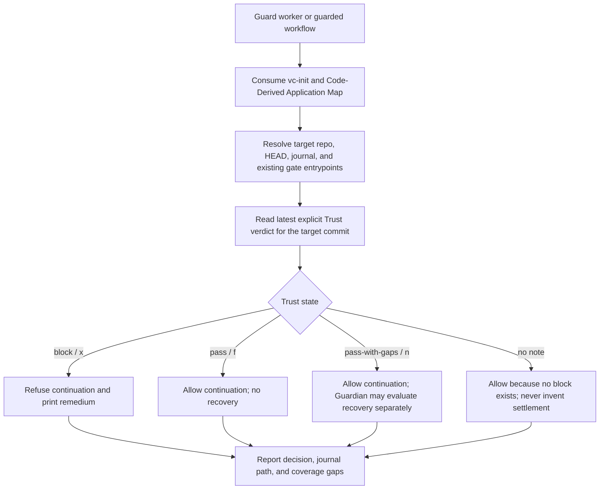

# `vc-guard` Flow — enforce, never judge

`vc-guard` consumes Trust truth. It does not derive a verdict or write an
f/x/n settlement.

## Flow

## Decision contract

| Trust truth      | Settlement | Guard decision | Guardian recovery                |
| ---------------- | ---------- | -------------- | -------------------------------- |
| `pass`           | `f`        | allow          | terminal; do not resume          |
| `pass-with-gaps` | `n`        | allow          | separately eligible under policy |
| `block`          | `x`        | refuse         | terminal; do not resume          |
| no explicit note | none       | allow          | no settlement to recover         |

Guardian recovery is a separate runtime authority. An `n` may be resumed only
through its native adapter, idempotency key, and automatic-attempt budget.
Guard itself never calls resume and never turns an allow decision into a trust
pass.

## Routes

| Entry                                                | Reads                                     | Produces                            |
| ---------------------------------------------------- | ----------------------------------------- | ----------------------------------- |
| `vibecrafted guard <agent> --prompt ...`             | repo map, gate surfaces, trust journal    | worker inventory/report             |
| `python -m vibecrafted_core.guard inventory`         | installed and repository gate entrypoints | named gate inventory + honest gaps  |
| `python -m vibecrafted_core.guard check`             | HEAD + latest journal record              | allow/refuse exit status + remedium |
| `python -m vibecrafted_core.guard check --sha <sha>` | named commit + latest journal record      | allow/refuse exit status + remedium |

## Hard boundaries

- Only an explicit Trust `block` refuses continuation.
- Missing judgment is not silently upgraded to either pass or block.
- Guard does not falsify claims, write trust notes, write settlements, or
  mutate repository code.
- Every refusal identifies the journal and the re-inspect/re-note path.
