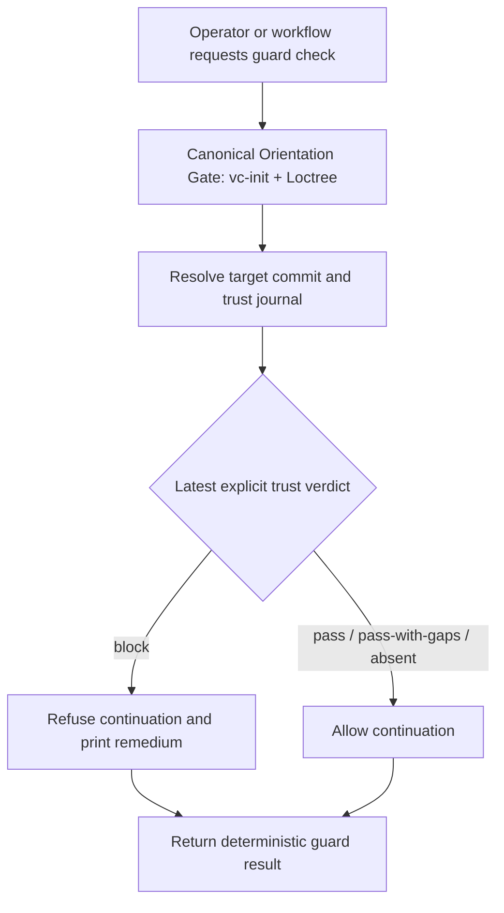

# `vc-guard` Flow

## Flow

## Routes

| Entry                                            | Args          | Produces                              | Exit |
| ------------------------------------------------ | ------------- | ------------------------------------- | ---- |
| `python -m vibecrafted_core.guard inventory`     | none          | gate inventory and coverage gaps      | `0`  |
| `python -m vibecrafted_core.guard check`         | optional SHA  | allow/refuse decision for target HEAD | `0` or refusal code |
| `vibecrafted guard <agent> --prompt <task>`      | prompt/file   | scoped guard report and artifacts     | `0` on dispatch |

### Boundaries

- Guard reads trust verdicts; it never creates or rewrites settlement.
- A recorded trust `block` refuses continuation and names the remedium path.
- Missing judgment is not silently converted into either pass or failure.

### Session artifacts

- Skill reports live under the normal `$VIBECRAFTED_HOME/artifacts/...` report root.
- Enforcement reads the append-only trust journal selected by the runtime.
- Guard writes no repository files and no trust-journal records.
