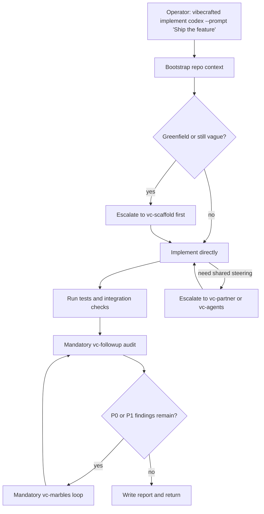

# `vc-implement` Flow — ship WRITE stage

> Skill id `implement`. VC-ship WRITE stage. Not an alias of `vc-justdo`.
> Run-id prefix: `impl-` (distinct from justdo's `just-`).

## Flow

## Routes

| Entry                           | Args                   | Produces                                    | Exit            |
| ------------------------------- | ---------------------- | ------------------------------------------- | --------------- |
| `vibecrafted implement <agent>` | `--prompt` or `--file` | implementation report, transcript, and meta | `0` on dispatch |
| `vc-implement <agent>`          | same                   | same                                        | `0` on dispatch |

Not routes of this skill: `vibecrafted justdo …` / `vc-justdo` (that is `vc-justdo`).

### Escalation edges

- Scope is still architectural → `vibecrafted scaffold <agent>`
- Shared steering is needed → `vibecrafted partner <agent>`
- P0/P1 issues remain → `vibecrafted marbles <agent>`

### Runtime identity

| Surface            | Value                                      |
| ------------------ | ------------------------------------------ |
| Skill id           | `implement`                                |
| Skill dir          | `vc-implement`                             |
| Matrix cell        | Ship-cycle WRITE stage                     |
| Run-id prefix      | `impl-`                                    |
| Ship stage?        | Yes — `SHIP_STAGES` order after scaffold   |
| Relation to justdo | Distinct id; do not collapse onto `justdo` |

### Session artifacts

- Artifact root: `$VIBECRAFTED_HOME/artifacts/<org>/<repo>/<YYYY_MMDD>/`
- Lock: `$VIBECRAFTED_HOME/locks/<org>/<repo>/<run_id>.lock`
- Outputs: `reports/<timestamp>_<slug>_<agent>.md` with matching `.transcript.log` and `.meta.json`
