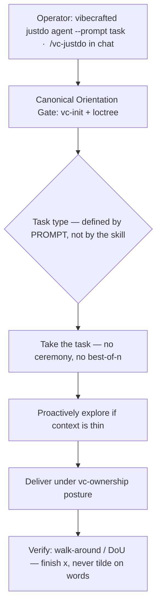

# `vc-justdo` Flow — standalone posture

> Own skill id `justdo`. Not an alias of `vc-implement`. Non-pipeline
> (ADR-0001 Accepted). Task type comes from the prompt. Run-id prefix: `just-`
> (distinct from implement's `impl-`).

## Flow

## Posture (not a pipeline phase)

`vc-justdo` stands **beside** the VC-ship read/write cadence. It is **not** the
WRITE phase (`vc-implement` is). It is the daily-rescue escape hatch: take the
task and finish. Task type (implement / review / audit / research / fix /
anything) is defined by the prompt.

## Routes

| Entry                                     | Args                   | Produces                                | Exit            |
| ----------------------------------------- | ---------------------- | --------------------------------------- | --------------- |
| `vibecrafted justdo <agent>`              | `--prompt` or `--file` | justdo runtime run (skill id `justdo`)  | `0` on dispatch |
| `vc-justdo <agent>`                       | same                   | shell entry → same skill id             | `0` on dispatch |
| `$vc-justdo` / `/vc-justdo` (interactive) | —                      | agent adopts Just Do posture in-session | —               |

Not routes of this skill: `vibecrafted implement …` (that is `vc-implement`).

### Boundaries (from `../vc-ownership/SKILL.md`)

- Move immediately: edits, tests, docs, scoped refactor, local smoke, recovery-commit.
- Pause + realign before irreversible: destructive git, push/merge/deploy/publish, spend, secrets/auth, prod data.

### Runtime identity

| Surface               | Value                                       |
| --------------------- | ------------------------------------------- |
| Skill id              | `justdo`                                    |
| Skill dir             | `vc-justdo`                                 |
| Matrix cell           | Additional skill launchers (not ship-cycle) |
| Run-id prefix         | `just-`                                     |
| Ship stage?           | No — absent from `SHIP_STAGES`              |
| Relation to implement | Distinct id; do not collapse to `implement` |

### Session artifacts

- Artifact root: `$VIBECRAFTED_HOME/artifacts/<org>/<repo>/<YYYY_MMDD>/`
- Lock: `$VIBECRAFTED_HOME/locks/<org>/<repo>/<run_id>.lock`
- Outputs: `reports/<timestamp>_<slug>_<agent>.md` with matching `.transcript.log` and `.meta.json`
