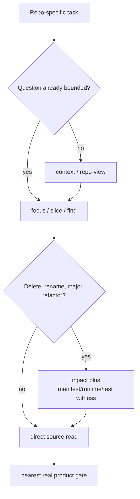

# `vc-loctree` Flow

Literal route: `loct find Name` → `--where-symbol` → `loct body Name`.
Discovery route: `loct find --discover Terms` → verify candidates literally.

Loctree maps represented structure. Destructive decisions require an independent
witness for entrypoints, manifests, generated/dynamic wiring, tests, and runtime.
