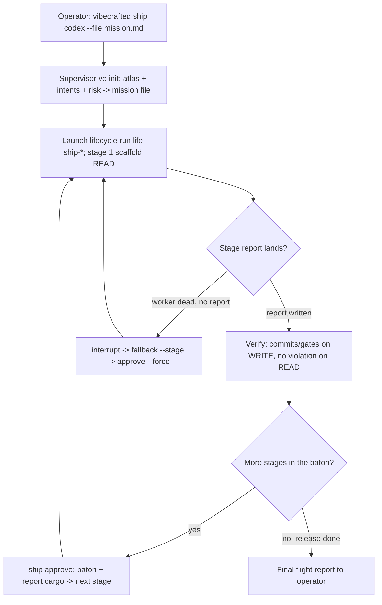

# `vc-ship` Flow

## Flow

## Routes

| Entry                      | Args                                      | Produces                                                    | Exit            |
| -------------------------- | ----------------------------------------- | ----------------------------------------------------------- | --------------- |
| `vibecrafted ship <agent>` | `--prompt` or `--file`, `[--start-stage]` | lifecycle run dir (`state.json`, transcript), stage reports | `0` on dispatch |
| `vc-ship <agent>`          | same                                      | same                                                        | `0` on dispatch |

### Escalation edges

- Mission has no grounded plan yet → `vibecrafted scaffold <agent>` first, then
  feed the plan file to `vc-ship` as the mission.
- Only one delivery cut is needed → `vibecrafted implement <agent>` /
  `vc-justdo`; the umbrella is overkill for a single known-shape change.
- Steering decisions exceed the standing mandates (publish, merge, spend) →
  stop and surface to the human operator; `vibecrafted partner <agent>` for
  shared steering.

### Session artifacts

- Artifact root: `$VIBECRAFTED_HOME/artifacts/<org>/<repo>/<YYYY_MMDD>/`
- Lifecycle run: `$VIBECRAFTED_HOME/control_plane/lifecycle_runs/<run_id>/state.json`
- Outputs: `reports/<stage>/…_report.md` per stage, with matching transcripts
  and meta under the runtime run dirs

### Anti-patterns

- Watching stage gates from inside a subagent (gate-nap, AGENT_OPS.md Class 1)
  — watchers live with the supervisor.
- Waiting out a stage budget on a dead worker instead of checking
  `status --json` → `stage_worker.worker_dead_without_report` (Class 2).
- Approving on silence: no report read, no commits verified, no button.
