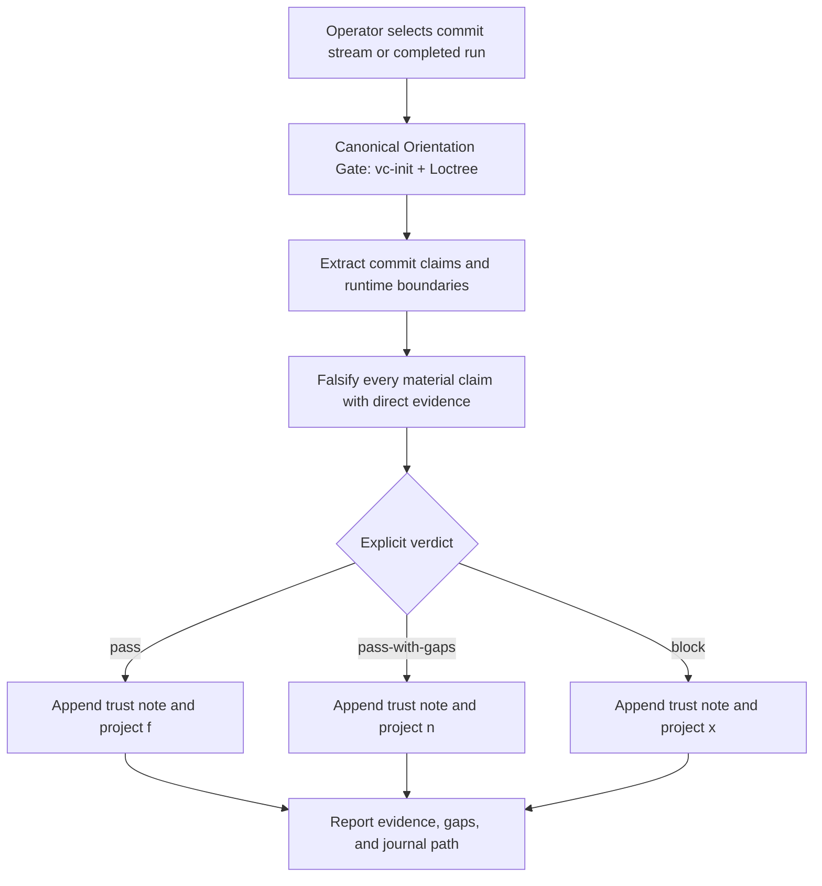

# `vc-trust` Flow

## Flow

## Routes

| Entry                                              | Args                         | Produces                                  | Exit |
| -------------------------------------------------- | ---------------------------- | ----------------------------------------- | ---- |
| `python -m vibecrafted_core.trust inspect <sha>`   | commit SHA                   | mechanical claim envelope; no judgment   | `0`  |
| `python -m vibecrafted_core.trust note <sha> ...`  | verdict plus claim evidence  | append-only trust note and settlement     | deterministic CLI result |
| `python -m vibecrafted_core.trust await-primary`   | run id, author, baseline SHA | completed-run boundary and candidates     | deterministic CLI result |
| `python -m vibecrafted_core.trust triage`          | optional run id              | latest canonical f/x/n roll-up            | `0`  |

### Boundaries

- Trust judges after the fact; it never edits code or blocks dispatch.
- Only an explicit `note` writes a verdict or settlement.
- Exit code, report presence, and await completion never imply trust.

### Session artifacts

- Journal: `$VIBECRAFTED_HOME/trust/journal.jsonl` unless explicitly overridden.
- Skill runs also emit the normal report, transcript, and metadata artifacts.
- Every report names verification performed, gaps, and the exact reviewed range.
