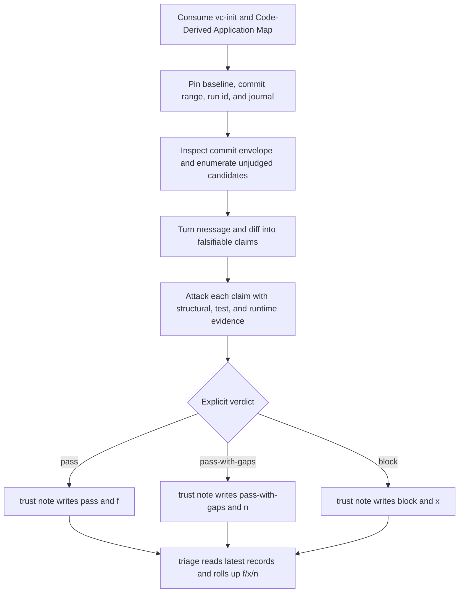

# `vc-trust` Flow — falsify, note, project

`vc-trust` judges explicit commit claims after the fact. Only `trust note`
writes durable judgment and projects it onto f/x/n.

## Flow

## Verdict contract

| Verdict          | Settlement | Meaning                         | Downstream behavior                               |
| ---------------- | ---------- | ------------------------------- | ------------------------------------------------- |
| `pass`           | `f`        | claims survived strong evidence | Guard allows; Guardian treats it as terminal      |
| `pass-with-gaps` | `n`        | named evidence gaps remain      | Guard allows; Guardian may attempt bounded resume |
| `block`          | `x`        | material claim failed           | Guard refuses; Guardian treats it as terminal     |

Guardian owns recovery mechanics, not Trust. An `n` remains a judgment even
when Guardian later performs one idempotent native resume; Trust never launches
that resume and never rewrites the verdict because a process restarted.

## Routes

| Entry                                                   | Mutates durable truth? | Purpose                                       |
| ------------------------------------------------------- | ---------------------- | --------------------------------------------- |
| `vibecrafted trust <agent> --prompt ...`                | report only            | run a bounded Trust worker                    |
| `python -m vibecrafted_core.trust inspect <sha>`        | no                     | mechanically extract commit facts             |
| `python -m vibecrafted_core.trust enumerate <author>`   | no                     | list unjudged candidate commits               |
| `python -m vibecrafted_core.trust await-primary <run>`  | no                     | await run boundary, then list candidates      |
| `python -m vibecrafted_core.trust note <sha> <verdict>` | **yes**                | append journal record and explicit settlement |
| `python -m vibecrafted_core.trust triage`               | no                     | roll up latest journal truth into f/x/n       |

## Evidence and write boundary

- `inspect`, `enumerate`, `await-primary`, exit status, and report presence
  never imply a pass and never write a settlement.
- Every material claim carries an evidence grade; a strong `pass` cannot be
  earned by message legality alone.
- Trust never edits code, amends/reverts commits, blocks dispatch, pushes, or
  merges.
- Guard is the enforcement reader; Guardian is the bounded recovery runtime.
